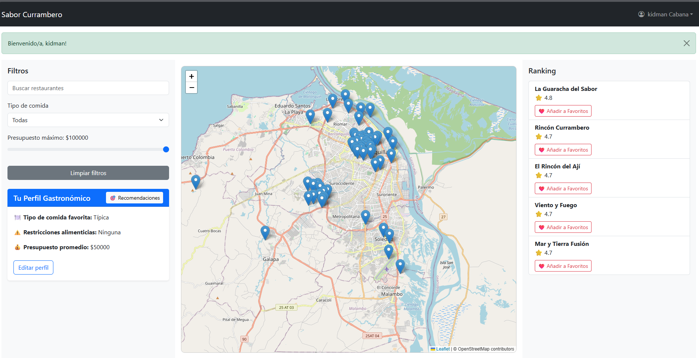

# 🌮 Sabor Currambero

**Sabor Currambero** es una aplicación web desarrollada con Flask que permite a usuarios explorar restaurantes, filtrar por tipo de comida y presupuesto, y gestionar su perfil gastronómico. El sistema incluye autenticación de usuarios y funcionalidades personalizadas según su rol (cliente o administrador).

---

## 🚀 Funcionalidades principales

- 🔐 Registro e inicio de sesión de usuarios
- ✨ Inicio de sesión automático tras registrarse
- 🎯 Redirección inteligente según el rol del usuario
- 🧾 Gestión de perfil gastronómico
- 📍 Mapa interactivo con Leaflet.js
- 🔍 Filtros dinámicos por tipo de comida, nombre y presupuesto
- ⭐ Ranking de restaurantes actualizado en tiempo real
- 👤 Panel de usuario según estado de sesión
- 📂 Estructura limpia con Blueprints y Bootstrap

---

## 📸 Vista previa



---

## 🧑‍💻 Tecnologías utilizadas

- **Python 3**
- **Flask**
- **Flask-WTF** para formularios
- **Flask-Login** para autenticación
- **Jinja2** para plantillas
- **Bootstrap 5** para estilos
- **Leaflet.js** para el mapa interactivo
- **MySQL** como sistema de base de datos
- **SQLAlchemy** como ORM

---

## ⚙️ Instalación local

### 1. Clona el repositorio

```bash
git clone https://github.com/tu-usuario/sabor-currambero.git
cd sabor-currambero
```

### 2. Crea un entorno virtual e instálalo

```bash
conda create -n sabor python=3.10
conda activate sabor
pip install -r requirements.txt
```

### 3. Crea un archivo `.env` con tus variables:

```env
SECRET_KEY=tu_clave_secreta
DATABASE_URL=mysql+pymysql://{user}:{password}@{host}:{port}/{database}
```

### 4. Ejecuta la aplicación

```bash
python run.py
```

---

## 🗃️ Estructura del proyecto

```
sabor-currambero/
│
├── app/
│   ├── __init__.py
│   ├── routes.py
│   ├── models.py
│   ├── forms.py
│   ├── templates/
│   │   ├── layout.html
│   │   ├── login.html
│   │   ├── register.html
│   └── static/
│       ├── js/mapa.js
│       └── css/styles.css
├── database/
│   └── SaborCurramberoMySQL.sql
│   └── Restaurantes.sql	
├── docs/
│   └── vista_previa.png
├── .env
├── .gitignore
├── requirements.txt
└── run.py
```

---

## ✅ Estado actual

✔️ Funcional  
🧪 En prototipo (sin contraseñas encriptadas)  
📦 Listo para entregar o continuar desarrollo

---

## 📄 Licencia

Este proyecto fue desarrollado con fines educativos para la materia **Diseño de Software I**.
